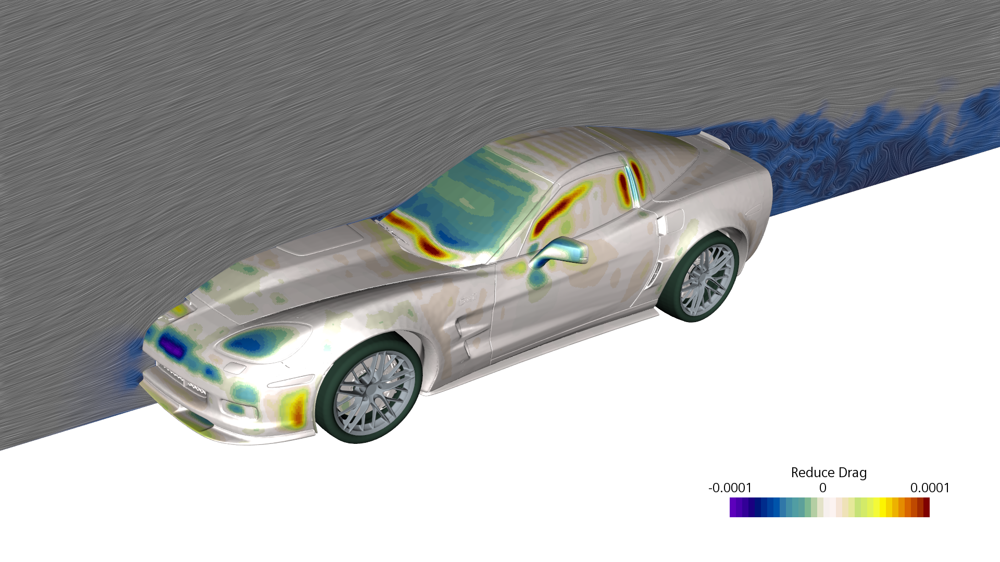
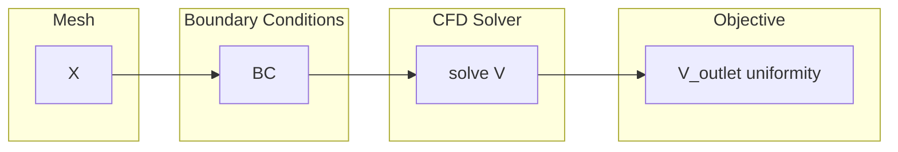
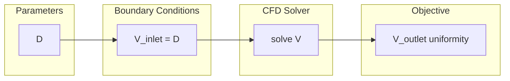

# Differentiating industrial software

### Dominic Jones, June 2023, dominic.jones@gmx.co.uk

Adjoint solvers and automatic differentiation engines have been under development in Siemens Star-CCM+ for over ten years. An assessment of this work will be presented, highlighting the basic methods employed, key programming language features leveraged in C++, and the longer term prospects of the project.

_Siemens Star-CCM+ adjoint: Coupled implicit flow solver_



---

## Adjoint retrospective

Computation of sensitivities should have first been offered as a feature using a tangent methodology. This should have later been extended to offer adjoint.

### What was done first

Sensitivity of an objective with respect to mesh coordinates necessarily requires adjoint; a tangent approach would not be viable. The absence of an end-to-end tangent implementation significantly inhibits adjoint development and testing.



### What should have been done first

Sensitivity of objectives with respect to BC parameters could be obtained by tangent or adjoint. Starting with tangent would have provided a far more practical grounding the development of the adjoint.



Also, there should be the capacity to evaluate the primal code path that is to be differentiated. This ensures that the code captures the minimal end-to-end path and using it for finite differencing will provide more representative results than the reference (primal) code path.

---


## Implementing the adjoint: A specification

A) A minimumally functional adjoint implementation requires:
1. an adequate linear solver (such as GMRes)
2. an adequate means of differentiating code (in house AD tool)
3. differentiating the minimum code path to obtain adequate sensitivities
4. support fundamental target builds (g++, clang, CPU + DD parallel)

B) A usable adjoint implementation needs that, but with:
1. parity memory overhead with the primal
2. parity runtime with the primal
3. capacity to converge on industrial scale problems

C) A maintainable adjoint implementation needs all that, plus:
1. a guide to converting code to be differentiable 'in three easy steps'
2. effectively zero code duplication
3. support all target builds (as above, plus GPU: nNvidia, AMD)

-> Industrial scale problems can be solved, covering A and B. But, maintainability, C, presents significant difficulties.


---

## Particular implementation decisions

### Mathematical types as differentiable types

A typical AD library treats the floating point type as the only fundamental differentiable numerical type. Here, the vector and tensor types are treated in the same way, too. This effectively rules out Jacobian taping approaches.

```cpp
Drv<mode, double> scalar;
Drv<mode, Vector<3, double>> vector;
Drv<mode, Tensor<3, double>> tensor;
```

### Each mode computes only its output

Tangent and adjoint ***do not*** produce the side effect of computing the primal; each mode ***strictly*** computes outputs proper to its mode.

### Primal and derivative storage is independent

This allows parallel exchanges to be optimially performed.

### Taping is off the table

Taping based approaches have never been used; l-value expression capture and class destructors fill the void (for adjoint).

### Rule of three

For any computation that requires allocation and dellocation, or more generally an initialization stage and a clear up stage, code is ***strictly*** split into three public methods:
1. `initialize(mode)`
2. `solve(mode)`
3. `clear(mode)`

where `mode` is the differentiation mode enum, i.e. `{PRIMAL, TANGENT, ADJOINT}`. The `solve' step ***never*** performs any publicly visible side effect.

### Algorithms are flat

Any algorithm with nested stages must be first rewritten as a flat sequence of steps in order to correctly evaluate the adjoint.


---

## Leveraged language features

C++17 seems to be a watershed for providing enough functionality for a relatively clean design. The following has proved to be highly beneficial:

1. `const` follows the primal

Nothing new, but worth stating. Let adjoint break const qualification under the hood, but at the top level have it like regular code.

2. Universal references for expressions
```cpp
template<typename E0, typename E1> auto dot_product(E0 &&e0, E1 &&e1) { return ... }
```
3. Variadic types for expressions
```cpp
template<typename... EE> class VariadicExprNode<EE...> { ... };
```
4. Type deduction for expressions
```cpp
auto const AV = dot_product(Area[f], Velocity[f]); // leverage 'const' to distinguish from a x-value expression?
```
5. Lambdas combined with CTAD for algorithms
```cpp
Y_Equation::solve(mode)
{
  auto step1 = Sequencer{mode, [&](){initialize_X(PRIMAL);}, [&](){initialize_X(mode);}, intermediate_op};
  auto step2 = Sequencer{mode, [&](){solve_X(PRIMAL);},      [&](){solve_X(mode);},      intermediate_op};
  auto step3 = Sequencer{mode, [&](){solve_Y(PRIMAL);},      [&](){solve_Y(mode);},      result_op};
  auto step4 = Sequencer{mode, [&](){clear_X(PRIMAL);},      [&](){clear_X(mode);},      clear_op};
}
// mode = adjoint: step1_pri, step2_pri, | step4_adj, step3_adj, step2_adj, step1_adj, | step1_pri
```
6. Compile-time branch evaluation for code unification
```cpp
if constexpr (mode == REF_PRIMAL) // ignored by all differentiable modes
{
  An[f] = src;
  Ap[f] += src;
}
```

---
  
## Maintainability

### Avoiding duplicate code

<table>
<tr>
<th>
Original
</th>
<th>
Duplicate or replace?
</th>
</tr>
<tr>
<td  valign="top">
<pre lang="cpp">
void hypot(double a,
           double b,
           double& r)
{
  auto const t0{a * a};
  auto const t1{b * b};
  auto const t2{std::sqrt(t0 + t1)};
  r = t2;
}
</pre>
</td>
<td  valign="top">
<pre lang="cpp">
template&lt;DrvMode::Option mode&gt;
void hypot(Drv&lt;mode, double&gt; a,
           Drv&lt;mode, double&gt; b,
           Drv&lt;mode, double&&gt; r)
{
  auto const t0{edrv(a * a)};
  auto const t1{edrv(b * b)};
  auto const t2{edrv(drv::sqrt(t0 + t1))};
  r = t2;
}
</pre>
</td>
</tr>
</table>

Currently, the adjoint implementation is duplicating, or reimplementing in slightly different ways, existing code.

This is unsustainable:
1. having a `reference primal' implementation (targetting CPU, GPU)
2. also having a differentiable implementation (targetting CPU)

 
The issues that need to be overcome to merge the code are:
1. accepting the use of differentiation annotations and layout
2. writing in an almost entirely `pure functional' manner
3. being able to ignore certain code paths
4. being able to ignore certain targets

### Supporting GPU targets

1. nVidia presently has a 4KB stack frame buffer limit, which prevents the vast majority of differentiated code being compiled
2. use of atomics appears to be a bad approach; colouring seems far more favourable

### Code differentiation by non-specialists

Expression templates are at the heart of the differentiation method used. Compilation errors are very off-putting for beginners, even for minor syntatical mistakes.


---

## Prospects

1. Unless code is unified under a single implementation then the functionality will eventually collapse under its own weight
2. Porting to GPU hase been a major help for promoting a style of programming favourable to differentiable code
3. An AD tool seems more appropriate for components; correct assembly of components can be helped by flow control tools

---
